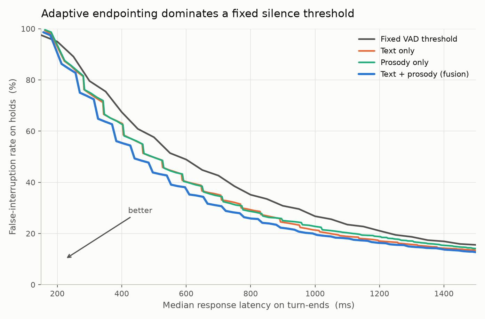

# Adaptive end-of-turn detection for voice agents

Voice agents decide you've stopped talking by waiting for a fixed amount of
silence. That one number can't work: short enough to feel responsive and it cuts
people off mid-sentence; long enough to survive a thinking pause and every reply
drags.

I checked this on real conversation data. A quarter of genuine turn-ends resolve
in under 320 ms, but the median pause where someone paused *and kept talking* is
576 ms. Those overlap, so no fixed threshold separates them.

This replaces the constant with a model. It reads the running transcript and the
prosody of the last 600 ms, outputs a calibrated probability that the speaker is
done, and scales the wait accordingly:

```
tau(p) = tau_min + (tau_max - tau_min) * (1 - p)
```

## Results

At a matched false-interruption rate, the model responds ~226 ms faster than the
best fixed threshold. The median gap between humans taking turns is about 200 ms,
so that's roughly one conversational beat per exchange.

| tolerated interruption rate | fixed threshold | text only | text + prosody |
|---|---|---|---|
| 15% | 1552 ms | 1347 ms | 1288 ms |
| 20% | 1232 ms | 1046 ms | 993 ms |
| 25% | 1063 ms | 892 ms | 829 ms |
| 30% | 932 ms | 771 ms | 714 ms |



| model | AUC | AP | ECE |
|---|---|---|---|
| text only | 0.751 | 0.483 | 0.046 |
| prosody only | 0.725 | 0.425 | 0.049 |
| text + prosody | 0.799 | 0.529 | 0.037 |

5,502 decision points, 32 speakers, 8 speaker groups. Every prediction is
out-of-fold from a model that never heard that speaker.

On one CPU core, 10-token input:

| runtime | size | p95 |
|---|---|---|
| PyTorch fp32 | 91 MB | 13.7 ms |
| ONNX fp32 | 91 MB | 7.1 ms |
| ONNX int8 | 23 MB | 3.1 ms |

int8 costs 0.004 AUC (0.862 -> 0.858). Sequence length matters more than the
backend: 8 tokens is 2.1 ms, 48 tokens is 10.6 ms, so padding to a worst case
costs 2.8x for nothing.

## Why prosody, and not just text

Before building anything I replicated Kelterer, Wepner, Linke & Schuppler,
*"Points of Maximum Grammatical Control"* (ICPhS 2023), which studied the prosody
of turn-holding in Austrian German. I wanted to know whether their findings hold
in English before designing features around them.

Articulation rate transfers strongly: speakers run at 4.19 syllables/sec before
a turn end and 2.5 when pausing mid-turn (p ~ 3e-67, speaker as a random effect).
Intensity transfers too, including the direction that contradicted the authors'
own hypothesis. None of the F0 measures reached significance, which matches their
weak F0 results.

The useful part was what didn't work. Their most important feature is a human
listening to each recording and labelling the final melody as finished-sounding
or continuing. A system can't have that. Using only computable features, one
specific comparison drops to chance (0.503 balanced accuracy) - and it was the
comparison they were best at. So the null result measures how much of the
published finding depends on something unavailable at inference time.

It also told me how to build the model: prosody decides whether the floor
changes, text decides whether the sentence is finished, and each is useless at
the other's job. That's why fusing them helps rather than just adding parameters.

One finding of my own: turn-ends have significantly less measurable voicing
(0.310 vs 0.377, p = 4e-17), consistent with creak at terminal juncture. Visible
only because I treated missing pitch values as signal instead of dropping those
windows.

## Things that were nearly wrong

**AMI's word timings can't express intra-turn pauses.** 92% of consecutive word
pairs are exactly contiguous - the aligner tiles words across each transcriber
segment, so a 500 ms thinking pause disappears into the neighbouring words. That
pause is the whole point of the project, so I got pauses from the audio with a
VAD instead, and used the annotations only to suppress headset bleed (46% of raw
VAD activity was other people's voices).

**A detector confound.** `crosstab(source, label)` came out block-diagonal: my
two label groups were timestamped by different tools, so the model could have
learned which tool produced the timestamp rather than anything about turn-taking.
Fixed by deriving every decision point from a single source.

**Pause duration is not a feature.** At inference the elapsed pause is the clock
you're racing, and its final value depends on whether you interrupt. It's the
evaluation variable, not an input.

**An ONNX "slowdown" that wasn't.** The converted model first looked 5x slower
than PyTorch. I assumed a hardware issue. The real cause was my benchmark padding
every input to 48 tokens when the real ones were 10.

`docs/06_leakage.md` covers the confounds in full.

## Pipeline

```
scripts/01  AMI manual annotations (word-level timings)
        02  AMI headset audio, 10 meetings x 4 channels
        03  Silero VAD -> pause structure, bleed suppression
        04  decision points + turn-taking labels
        05  prosody features, speaker-normalised
        06  replication: pairwise random forests + mixed-effects models
        07  train text / prosody / fusion, speaker-disjoint out-of-fold
        08  operating curve
        09  ONNX export, int8, CPU latency
        10  live microphone demo
```

## Setup

```bash
python3 -m venv .venv && source .venv/bin/activate
pip install -r requirements.txt
python -m spacy download en_core_web_sm

bash scripts/01_download_annotations.sh
bash scripts/02_download_audio.sh          # ~2 GB
for s in 03 04 05 06 07 08 09; do python scripts/${s}_*.py; done
python scripts/10_demo.py                  # needs sounddevice
```

## Limitations

AMI is four-party meetings, not two-party support calls. People pause far more in
meetings, so the absolute interruption rates are domain-specific; the controlled
comparison between systems is what transfers.

`change` is the smallest class (1,262 of 5,502). Syntactic-completion labels come
from a rule over the dependency parse, not human annotation - the original paper
had inter-rater kappa of 0.84, which is also the realistic ceiling here. My
geometric substitutes for their hand-annotated contour label didn't recover it; a
learned contour classifier is the obvious next thing to try. And there's no
Hinglish and no telephone-band audio, both of which matter for the deployment I
care about.

## Docs

`01_the_problem.md` latency budget and why fixed thresholds fail ·
`02_data.md` getting labels without annotators ·
`03_pmgc_framework.md` the turn-taking taxonomy ·
`04_replication_spec.md` the paper's exact method ·
`05_ami_primer.md` corpus, microphones, VAD ·
`06_leakage.md` the four confounds ·
`07_replication_results.md` what replicated ·
`08_system_design.md` model, calibration, policy, deployment ·
`09_defence.md` design decisions
